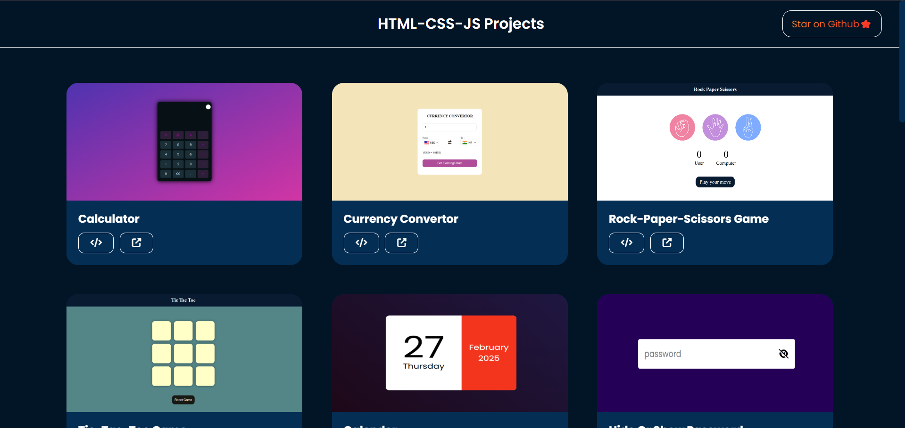

# 🚀 HTML, CSS & JavaScript Mini Projects Website  

Welcome to the **HTML, CSS & JavaScript Mini Projects Website!** 🎨✨  
This website showcases various **mini projects** I created to enhance my front-end development and JavaScript skills. Each project comes with an **image preview**, **source code link**, and **live demo link** for easy access.  

This is part of my journey to master front-end development, JavaScript logic, and UI/UX design. 🚀  

---

## 📌 Overview  

This website is designed to:  
✅ Showcase **each project** with a preview image  
✅ Provide **live deployment links** for direct interaction  
✅ Offer **source code access** for easy learning  
✅ Feature **JS animations** with ScrollReveal for smooth effects  
✅ Ensure **full responsiveness** for all projects  
✅ Include a **Back-to-Top button** for seamless navigation  
✅ Have a **footer with useful resources**  

Built to help beginners explore and learn front-end development interactively! 🌱  

---

## 📸 Screenshots  

  

---

## 🌐 Live Demo  

The project is live and can be viewed here: [HTML, CSS & JS Mini Projects Website](https://html-css-js-projects-five.vercel.app/)  

---

## 🛠 Technologies Used  

- **🌍 HTML5** – Structuring web pages  
- **🎨 CSS3** – Styling, animations, and layouts  
- **⚡ JavaScript** – Logic, interactions, and functionalities  
- **📜 ScrollReveal.js** – Smooth animation effects  
- **🖊️ VS Code** – Primary code editor  
- **🐙 Git & GitHub** – Version control and hosting  

---

## 📂 Projects Listed  

Each project includes:  
📸 **Image Preview** | 📜 **Code Link** | 🔗 **Live Demo**  

---

## 📂 Projects  

> **Utility & Interactive Tools**  

1. **Calculator** – A basic calculator with JavaScript functionality.  
2. **Currency Converter** – Convert between different currencies dynamically.  
3. **Rock-Paper-Scissors Game** – A fun interactive game with JavaScript logic.  
4. **Tic-Tac-Toe Game** – Classic two-player tic-tac-toe game.  
5. **Calendar** – A simple calendar display with JavaScript.  
6. **Hide and Show Password** – A toggle button to show/hide passwords.  
7. **Coming Soon Page with Launch Countdown** – A stylish countdown timer for upcoming events.  
8. **Digital Clock** – A live digital clock displaying the current time.  
9. **Random Password Generator** – Generate secure random passwords.  
10. **Password Strength Indicator** – Visual indicator for password strength.  
11. **Random Quote Generator** – Get a new random quote with each click.  
12. **Drag and Drop Items** – A simple drag-and-drop functionality.  
13. **QR Code Generator** – Generate QR codes from input text.  
14. **Select Menu Design** – Custom-styled dropdown select menus.  
15. **Text-to-Speech Converter** – Convert written text into spoken words.  
16. **Age Calculator** – Calculate your age based on input birthdate.  
17. **Toast Notification** – A simple toast notification popup.  
18. **Stopwatch** – A functional stopwatch with start, stop, and reset.  

---

## Why This Project?  

This repository is part of my #100DaysOfCode challenge to improve my JavaScript and front-end skills. Each project reflects the skills I’m building along the way.  

---

## ⚙️ Prerequisites  

Before running the projects, ensure you have the following installed:  

- 🖥️ **A modern web browser** (Chrome, Firefox, Edge, etc.)  
- 📝 **VS Code** (or any code editor)  
- 🌐 **Git** (optional, for cloning the repository)  

---

## Resources  

These are the resources I used to learn and build these projects:  

- [MDN Web Docs (JavaScript)](https://developer.mozilla.org/en-US/docs/Web/JavaScript)  
- [GreatStack youtube channel](https://www.youtube.com/playlist?list=PLjwm_8O3suyOgDS_Z8AWbbq3zpCmR-WE9)  

---

## 🛠 Installation & Usage  

To use these projects locally, follow these steps:  

1️⃣ **Clone this repository**  
```bash  
git clone https://github.com/your-username/html-css-js-mini-projects.git  
```

2️⃣ **Open a project folder and launch the `.html` file in your browser.**  

🚀 No dependencies required! Just HTML, CSS & JavaScript.  

---

Feel free to explore, use, and modify these projects. If you find them helpful, consider giving this repo a ⭐! 😊
